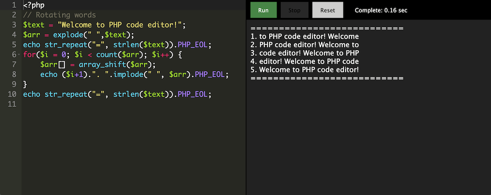

# Codebox

v0.0.1 / Proof of concept

Codebox is simple coding environment made for embedding on web pages.

For every execution it runs docker container, executes user code and forwards the output to the browser through Socket.io

## Installation

You need a server with Docker installed

### Installation for Digital Ocean droplet with Docker on Ubuntu 20.04

All commands run from 'root' user

Install Node, Nginx and Certbot (for SSL)

  apt update
  apt install nodejs npm nginx certbot python3-certbot-nginx

Clone the repo

  mkdir /var/opt/sandbox; cd /var/opt/sandbox
  git clone https://github.com/nukinuki/codebox

Install the dependencies

  npm install

For development:

  npm install -g nodemon
  npm run watch

For production:

  npm install -g pm2
  pm2 start /var/opt/sandbox/bin/www

Additional commands for production:

  pm2 logs www
  pm2 stop www
  pm2 restart www

Pull some Docker images before using them in editor. For nodejs and php environments:

  docker pull mhart/alpine-node:slim
  docker pull php

Server is available on port 3000, you can test it is running by opening demo embed in the browser:

  http://<YOUR-SERVER-IP>:3000/embed/js-001-console

You might need to open the port 3000 or route it through Nginx.

  ufw allow 3000

or

  ufw allow in "Nginx Full"

If you route through Nginx, edit ``/etc/nginx/sites-enabled/default``

To top level block:

  upstream codebox {
    server 127.0.0.1:3000;
  }

To the server block:

  server_name YOUR_DOMAIN;

  location / {
    proxy_set_header X-Real-IP $remote_addr;
    proxy_set_header X-Forwarded-For $proxy_add_x_forwarded_for;
    proxy_set_header Host $http_host;
    proxy_set_header X-NginX-Proxy true;

    proxy_pass http://codebox;
    proxy_redirect off;
  }

Restart Nginx:

  service nginx restart

Install Let's encrypt SSL certificate. Certbot will fix the nginx config for you, making it listen to port 443:

  certbot --nginx
  service nginx restart

## Usage

To create a new embed, you need to put YAML config file in ``/configs/`` directory. Name of your config file is the url slug in ``http://YOUR_SERVER:3000/embed/YOUR_CONFIG_NAME``

Example config:

  # JS Course. 001. Console
  lang: js
  editor:
    - '// Write your code here'
    - ''
  sandbox: nodejs
  timeout: 10

## Additional platforms and custom docker images

That can be customized in ``/lib/platforms.js`` file

## TODO

 - Persistent containers for user session (for SQL playgrounds)
 - Option to close outbound internet connections from sandbox environments, to prevent spam/bot abuse
 - Quizzes: Checking the output of the code execution against some expected output and mark as done